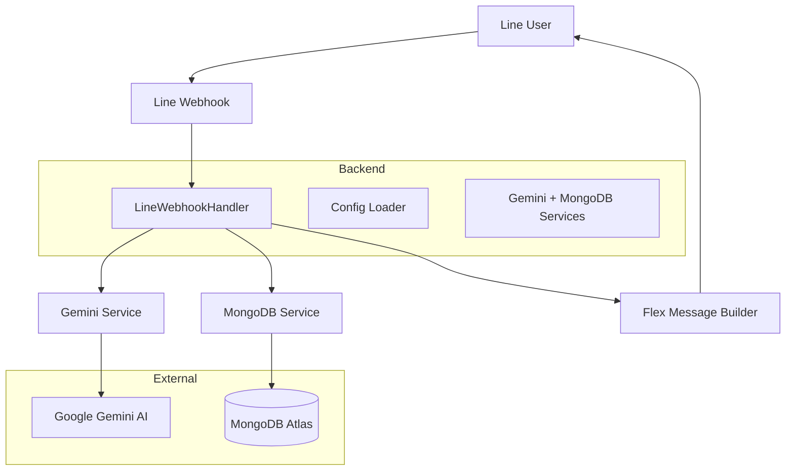

# Satisatang (สติสตางค์) Project Analysis

## Overview
Satisatang is a personal finance assistant built as a Line OA (Official Account) bot. It helps users track income, expenses, transfers, and budgets through natural language conversations and receipt image uploads. The backend is written in Go, uses MongoDB for storage, Gemini AI for NLP and image analysis, and Line's Messaging API for rich interactions.

## Core Capabilities

### 1. **Transaction Recording**
- **Text Input:** Users send messages like "กินข้าว 150 บาท" or "เงินเดือน 30000 เข้ากรุงไทย". Gemini AI parses the text and returns a structured JSON action (`new`, `update`, `transfer`, etc.).
- **Image Input:** Users can upload receipt photos. Gemini extracts merchant, date, amount, category, and line items, then auto‑saves the transaction.
- **Flex Message Response:** Each recorded transaction is confirmed with a visually rich Flex Message showing amount, category, payment method, and updated balance.

### 2. **Payment Method Tracking**
- Three payment types:
  - `0` – Cash (เงินสด)
  - `1` – Credit Card (บัตรเครดิต) – treated as liability
  - `2` – Bank (ธนาคาร) – asset account
- Balances are calculated per payment method and aggregated into a net‑worth view.

### 3. **Transfers (Many‑to‑Many)**
- Supports complex transfers like "โอน 3000 จากเงินสด และ 2000 จากกรุงไทย เข้ากรุงเทพ".
- Creates matching expense (from) and income (to) transactions, linked by a transfer record.

### 4. **Budget Management**
- Set monthly budgets per category (e.g., food, travel).
- Real‑time spending vs. budget comparison with color‑coded alerts (✅🟡🔴).
- Budget status included in transaction confirmations.

### 5. **Search & Analysis**
- **Search:** Keyword‑based transaction lookup across description, category, merchant.
- **AI Analysis:** Ask "สรุปวันนี้" or "ใช้จ่ายอะไรเยอะสุด" – Gemini analyzes recent transactions and returns insights, summaries, and advice in a formatted Flex Message.

### 6. **Chat & Context Awareness**
- Maintains chat history (last 20 messages) and recent transaction context (last 7 days) to make conversations more natural.
- Supports casual chat, financial questions, and action‑oriented commands.

### 7. **Interactive UI via Line**
- Quick‑reply buttons for common actions (ดูยอดคงเหลือ, สรุปวันนี้, โอนเงิน, etc.).
- Postback actions to delete/edit transactions directly from the chat.
- Carousel layouts for multiple transactions or search results.

## Architecture

### Key Components
- **`main.go`** – Initializes config, services, Gin router; exposes `/health` and `/webhook/line`.
- **`config/`** – Loads environment variables (Line secrets, Gemini API key, MongoDB URI) and validates them.
- **`services/`** – `GeminiService` (chat, receipt parsing) and `MongoDBService` (CRUD for transactions, transfers, budgets, chat history).
- **`handlers/`** – `LineWebhookHandler` processes webhook events, calls AI, saves data, and constructs Flex Messages.
- **`markdown/`** – Project specifications, data models, and rules.

## Technology Stack
| Layer | Technology |
|-------|------------|
| Language | Go 1.21+ |
| Web Framework | Gin |
| Database | MongoDB Atlas (go.mongodb.org driver) |
| AI | Google Generative AI (Gemini) |
| Messaging | Line Bot SDK v8 |
| Configuration | godotenv (.env) |
| Deployment | Vercel (planned) |

## Current Project Status
- **✅ Core functionality** – Fully implemented and appears production‑ready.
- **✅ Error handling & logging** – Comprehensive throughout.
- **✅ Documentation** – Good internal comments and markdown specs.
- **🟡 Testing** – Some test files (`test_ai.go`, `test_ai_hard.go`) exist but not integrated into CI.
- **🔴 Web dashboard** – Mentioned in spec but not yet implemented.
- **🔴 Automated deployment** – Rules require manual approval before deploy.

## Potential Improvements & Extensions
1. **Web Dashboard** – Build a React/Vue frontend with Line login for detailed analytics and transaction management.
2. **Enhanced AI** – Add forecasting, multi‑currency, and better Thai‑receipt parsing.
3. **Export & Reporting** – CSV/PDF exports, monthly statements.
4. **Notifications** – Push alerts for budgets and large transactions.
5. **Security** – Encrypt sensitive fields, add audit logs.
6. **Testing & CI/CD** – Write unit/integration tests, set up GitHub Actions with approval gates.
7. **Performance** – Cache balances, add database indexes.
8. **Multi‑user Features** – Shared budgets, bill splitting.
9. **Bank Integration** – Open Banking APIs for automatic transaction sync (if available in Thailand).
10. **Localization** – Support English alongside Thai.

## What Can Be Done Next?
- **Immediate:** Set up staging environment, run existing tests, deploy to Vercel for validation.
- **Short‑term:** Implement the missing web dashboard (basic version).
- **Medium‑term:** Add export feature and budget notifications.
- **Long‑term:** Explore bank integrations and advanced AI insights.

## Constraints & Rules
- **Do not modify/delete the `markdown/` folder.**
- **Deploy to Vercel.com.**
- **No automatic deployment – must wait for AI Manager approval.**
- **Use Go, Line OA, Gemini as core technologies.**

## Conclusion
Satisatang is a well‑architected, feature‑rich personal finance bot that successfully combines modern AI with practical daily money tracking. It is ready for production use on Line, with clear pathways for extension into a full‑fledged financial wellness platform.

---
*Analysis performed by Roo (Architect mode) on 2025‑12‑09*